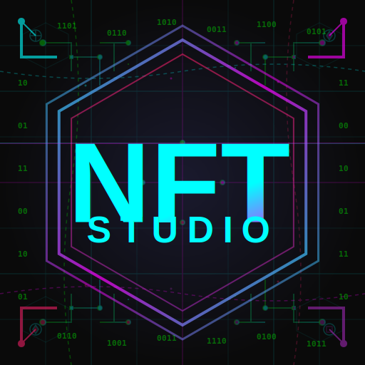

<div align="center">
  
  
  # NFT Studio
  
  **A powerful desktop application for creating, editing, and rendering NFT collections**
  
  [](https://www.electronjs.org/)
  [](https://reactjs.org/)
  [](LICENSE)
  
</div>

---

## 🎯 What It Does

NFT Studio provides a graphical interface for the [my-nft-gen](https://github.com/yourusername/my-nft-gen) library, enabling artists and creators to design generative NFT collections with real-time visual feedback and professional-grade effects.

**Key Features:**
- **Visual Effect Editor** - Layer and configure effects with live preview
- **Resolution Management** - Auto-scaling across multiple resolutions (1K-8K)
- **Project Persistence** - Save/load `.nftproject` files
- **Undo/Redo System** - Full command history with 50-action buffer
- **Batch Rendering** - Generate entire collections with progress tracking
- **Color Scheme Library** - Manage and favorite color palettes

---

## 🚀 Quick Start

### Installation
```bash
# Clone the repository
git clone https://github.com/yourusername/nft-studio.git
cd nft-studio

# Install dependencies
npm install

# Start development build
npm run start:dev
```

### Building for Production
```bash
# Build for all platforms
npm run package

# Platform-specific builds
npm run package:mac    # macOS (x64 + ARM64)
npm run package:win    # Windows (x64 + x86)
npm run package:linux  # Linux (AppImage, deb, snap)
```

---

## 🏗️ Architecture

**Tech Stack:**
- **Frontend:** React 18 + Material UI + Radix UI
- **Backend:** Electron 30 with secure IPC bridge
- **Build System:** Webpack 5 + Babel 7
- **Rendering Engine:** my-nft-gen (Canvas + Sharp)

**Design Patterns:**
- **Command Pattern** - Undo/redo functionality
- **Event Bus** - Decoupled component communication
- **Dependency Injection** - Service layer architecture
- **Single Source of Truth** - Centralized state management via `ProjectState`

---

## 🧪 Testing

```bash
# Run all tests
npm test

# Run specific test suites
npm run test:unit         # Unit tests
npm run test:integration  # Integration tests
npm run test:system       # System tests
npm run test:services     # Service layer tests
```

**Test Coverage:** Comprehensive suite with unit, integration, and regression tests located in `tests/` directory.

---

## 📁 Project Structure

```
nft-studio/
├── src/
│   ├── components/     # React UI components
│   ├── services/       # Business logic layer
│   ├── commands/       # Command pattern implementations
│   ├── models/         # Data models (ProjectState, etc.)
│   ├── effects/        # Effect configurations
│   └── utils/          # Helper utilities
├── main.js             # Electron main process
├── preload.js          # Secure IPC bridge
├── render.js           # React entry point
└── tests/              # Test suite
```

---

## 🎨 Visual Identity

The animated cyberpunk icon features real-time CSS animations including a scanning line effect and Matrix-style digital rain. See [ANIMATED_ICON_GUIDE.md](docs/ANIMATED_ICON_GUIDE.md) for technical details.

---

## 📝 License

MIT License - see [LICENSE](LICENSE) file for details.

---

## 🤝 Contributing

This is a personal project, but feedback and suggestions are welcome. Please open an issue to discuss proposed changes.

---

<div align="center">
  
  
  **Built with ❤️ for the NFT creator community**
</div>