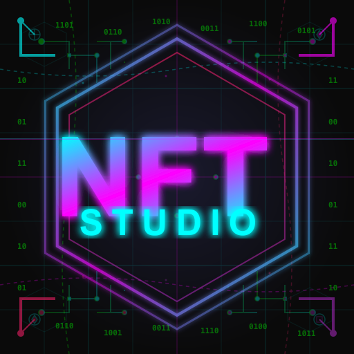

# NFT Studio

<div align="center">

  

  **A powerful desktop application for creating and generating NFT collections**

  [](https://www.electronjs.org/)
  [](https://reactjs.org/)
  [](https://nodejs.org/)
  [](LICENSE)

</div>

## 📖 Table of Contents

- [Overview](#-overview)
- [Features](#-features)
- [Screenshots](#-screenshots)
- [Prerequisites](#-prerequisites)
- [Installation](#-installation)
- [Development](#-development)
- [Building](#-building)
- [Testing](#-testing)
- [Project Structure](#-project-structure)
- [Architecture](#-architecture)
- [Contributing](#-contributing)
- [Support](#-support)
- [License](#-license)

## 🎨 Overview

NFT Studio is a comprehensive desktop application built with Electron and React that provides an intuitive graphical interface for the `my-nft-gen` NFT generation engine. It enables artists and creators to design, configure, and generate unique NFT collections with various effects, layers, and customization options - all without writing a single line of code.

### Key Highlights

- 🖼️ **Visual NFT Creation** - Design NFTs with an intuitive drag-and-drop interface
- 🎯 **Real-time Preview** - See your changes instantly with live effect previews
- 🔧 **Advanced Effects** - Apply complex visual effects and transformations
- 📊 **Progress Monitoring** - Track generation progress with real-time event display
- 🎨 **Color Scheme Creator** - Build custom color palettes for your collections
- 💾 **Project Management** - Save, resume, and organize multiple NFT projects

## ✨ Features

### Core Functionality

- **Project Creation & Management**
  - Create new NFT generation projects from scratch
  - Resume and edit existing projects
  - Import/export project configurations
  - Automatic project saving and recovery

- **Visual Effect System**
  - Multi-step effect wizard for easy configuration
  - 20+ built-in effects (blur, pixelate, glitch, etc.)
  - Effect chaining and layering
  - Real-time effect preview with thumbnails
  - Custom effect parameter tuning

- **Layer Management**
  - Drag-and-drop layer ordering
  - Layer opacity and blend mode controls
  - Rarity configuration for traits
  - Conditional layer rendering

- **Generation Engine**
  - Batch generation of NFT collections
  - Progress tracking with event bus display
  - Frame-by-frame preview
  - Export to multiple formats (PNG, JPG, GIF)
  - Metadata generation (JSON, CSV)

- **Advanced Tools**
  - Color scheme creator with palette management
  - Dynamic UI generation based on effect configurations
  - Config introspection for automatic form generation
  - Integrated file browser and manager

## 📋 Prerequisites

Before installing NFT Studio, ensure you have the following:

- **Node.js** version 18.0 or higher
- **npm** version 8.0 or higher
- **Git** for cloning the repository
- **Python** (for native dependencies compilation)
- **Build tools** for your platform:
  - **macOS**: Xcode Command Line Tools
  - **Windows**: windows-build-tools
  - **Linux**: build-essential

### Platform-specific Requirements

#### macOS
```bash
xcode-select --install
```

#### Windows
```bash
npm install --global windows-build-tools
```

#### Linux (Ubuntu/Debian)
```bash
sudo apt-get install build-essential
```

## 🚀 Installation

### 1. Clone the Repository

```bash
git clone https://github.com/yourusername/nft-studio.git
cd nft-studio
```

### 2. Install Dependencies

```bash
# Install all dependencies
npm install

# Rebuild native modules for Electron
npm run rebuild
```

### 3. Set Up the NFT Generation Engine

NFT Studio requires the `my-nft-gen` package to be available locally:

```bash
# Clone the my-nft-gen repository (if not already present)
cd ..
git clone https://github.com/yourusername/my-nft-gen.git
cd nft-studio
```

### 4. Start the Application

```bash
# Development mode with hot reload
npm run dev

# Production mode
npm start
```

## 💻 Development

### Development Commands

```bash
# Start webpack in watch mode
npm run dev

# Launch Electron app (without rebuilding)
npm run electron

# Build for production
npm run build

# Clean and start fresh
npm run clean:start
```

### Environment Setup

1. **Configure your IDE**
   - Install React and JSX extensions
   - Configure Babel for ES6+ support
   - Set up ESLint for code quality

2. **Development Workflow**
   ```bash
   # Start development server
   npm run dev

   # In another terminal, launch Electron
   npm run electron
   ```

3. **Hot Reload**
   - Frontend changes reload automatically
   - Main process changes require app restart

### Debugging

- **DevTools**: Press `Ctrl+Shift+I` (or `Cmd+Option+I` on macOS) in the app
- **Main Process**: Use `--inspect` flag with Electron
- **React DevTools**: Install the standalone version for Electron apps

## 📦 Building

### Build for Current Platform

```bash
npm run build
npm run package
```

### Build for Specific Platforms

```bash
# macOS
npm run package:mac

# Windows
npm run package:win

# Linux
npm run package:linux

# All platforms
npm run package:all
```

### Build Configuration

The build process is configured in `package.json` under the `build` key. Key settings:

- **App ID**: `com.yourcompany.nft-studio`
- **Product Name**: NFT Studio
- **Directories**:
  - Output: `release/`
  - Resources: `build/`

## 🧪 Testing

NFT Studio includes a comprehensive test suite with custom test runner and mocking system.

### Running Tests

```bash
# Run all tests
npm test

# Run specific test suites
npm run test:app        # Application tests
npm run test:canvas     # Canvas rendering tests
npm run test:wizard     # Effect wizard tests
npm run test:services   # Service layer tests
npm run test:ipc       # IPC communication tests

# Quick verification
npm run test:verify     # Fast smoke tests
```

### Test Structure

```
tests/
├── unit/           # Unit tests for individual components
├── integration/    # Integration tests for features
├── regression/     # Regression test suite
├── mocks/         # Mock objects and fixtures
├── setup.js       # Global test configuration
└── utils/         # Test utilities and helpers
```

### Writing Tests

```javascript
// Example test file: tests/unit/my-component.test.js
import { test, expect } from '../setup.js';
import MyComponent from '../../src/components/MyComponent.jsx';

test('MyComponent renders correctly', async () => {
  const component = new MyComponent();
  const result = await component.render();
  expect(result).toContain('expected content');
});
```

## 📁 Project Structure

```
nft-studio/
├── src/                    # Source code
│   ├── App.jsx            # Main React component
│   ├── pages/             # Application screens
│   │   ├── Welcome.jsx    # Welcome/landing page
│   │   ├── NewProject.jsx # Project creation
│   │   ├── Resume.jsx     # Project selection
│   │   └── Edit.jsx       # Project editor
│   ├── components/        # Reusable components
│   │   ├── EffectWizard/  # Effect configuration wizard
│   │   ├── EventBusDisplay/ # Real-time event display
│   │   ├── ColorSchemeCreator/ # Color palette tool
│   │   └── EffectPreview/ # Live preview system
│   ├── services/          # Backend services
│   │   ├── ApplicationFactory.js
│   │   ├── ProjectService.js
│   │   └── EffectService.js
│   ├── hooks/            # Custom React hooks
│   └── utils/            # Helper utilities
├── tests/                # Test suite
├── dist/                # Build output (generated)
├── release/             # Packaged apps (generated)
├── icons/               # Application icons
├── docs/                # Documentation
├── main.js              # Electron main process
├── render.js            # React entry point
├── preload.js           # Secure IPC bridge
├── webpack.config.js    # Webpack configuration
└── package.json         # Project configuration
```

## 🏗️ Architecture

### Technology Stack

- **Frontend Framework**: React 18.3.1
- **Desktop Framework**: Electron 30.0.6
- **Build Tool**: Webpack 5.91.0
- **UI Components**: Material-UI, Radix UI
- **Styling**: CSS with custom styles
- **IPC**: Electron IPC with secure context bridge

### Architectural Patterns

#### Main Process (main.js)
- Handles all file system operations
- Manages IPC communication channels
- Controls application lifecycle
- Interfaces with my-nft-gen engine

#### Renderer Process (React)
- Component-based architecture
- Custom hooks for state management
- Service layer with dependency injection
- Event-driven communication

#### IPC Communication
```javascript
// Renderer → Main
await window.api.readFile(path);

// Main → Renderer
ipcMain.handle('read-file', async (event, path) => {
  return await fs.readFile(path);
});
```

### Key Design Decisions

1. **Separation of Concerns**: Clear separation between UI and business logic
2. **Security**: Secure IPC bridge prevents direct filesystem access from renderer
3. **Modularity**: Component-based architecture for reusability
4. **Performance**: Lazy loading and code splitting for optimal performance
5. **Extensibility**: Plugin-based effect system for easy additions

## 🤝 Contributing

We welcome contributions! Please follow these guidelines:

### Getting Started

1. Fork the repository
2. Create a feature branch (`git checkout -b feature/amazing-feature`)
3. Commit your changes (`git commit -m 'Add amazing feature'`)
4. Push to the branch (`git push origin feature/amazing-feature`)
5. Open a Pull Request

### Code Style

- Use ES6+ features
- Follow existing code conventions
- Add JSDoc comments for functions
- Write tests for new features
- Ensure all tests pass before submitting

### Commit Messages

Follow conventional commits format:
- `feat:` New feature
- `fix:` Bug fix
- `docs:` Documentation changes
- `style:` Code style changes
- `refactor:` Code refactoring
- `test:` Test additions/changes
- `chore:` Maintenance tasks

## 🆘 Support

### Documentation

- [User Guide](docs/user-guide.md)
- [Developer Guide](docs/developer-guide.md)
- [API Reference](docs/api-reference.md)
- [Troubleshooting](docs/troubleshooting.md)

### Getting Help

- **Issues**: [GitHub Issues](https://github.com/yourusername/nft-studio/issues)
- **Discussions**: [GitHub Discussions](https://github.com/yourusername/nft-studio/discussions)
- **Discord**: [Join our Discord](https://discord.gg/nft-studio)
- **Email**: support@nft-studio.com

### Reporting Bugs

When reporting bugs, please include:
- Operating system and version
- Node.js and npm versions
- Steps to reproduce the issue
- Expected vs actual behavior
- Error messages and logs

## 📄 License

This project is licensed under the MIT License - see the [LICENSE](LICENSE) file for details.

## 🙏 Acknowledgments

- Built on top of the amazing [my-nft-gen](https://github.com/yourusername/my-nft-gen) engine
- Thanks to all contributors and the open source community
- Special thanks to the Electron and React teams

---

<div align="center">
  Made with ❤️ by the NFT Studio Team
</div>